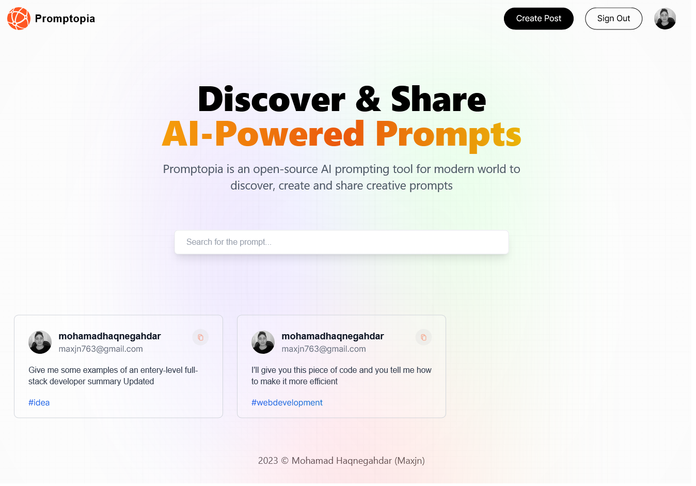

# Promtopia - Nextjs v13.4

This is a basic practical crud [Next.js](https://nextjs.org/) project bootstrapped with [`create-next-app`](https://github.com/vercel/next.js/tree/canary/packages/create-next-app).

It's a serverless crud app with authentication and other features, explore the [demo](https://maxjn-promptopia.vercel.app/) for better understanding'

## Technologies

- JSX, Css, Tailwind
- ES6
- React
- **Nextjs v13.5**
- **Packages:** bcrypt, mongodb, mongoose, next-auth
- **Routing:** useing new app directory

## Features

-

## Installation

Install **Promptopia** with npm

```shell
npm install

npm run dev
```

## Screenshots


